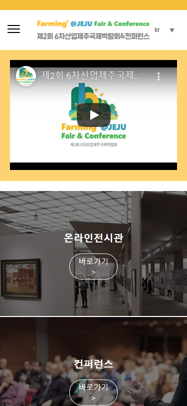
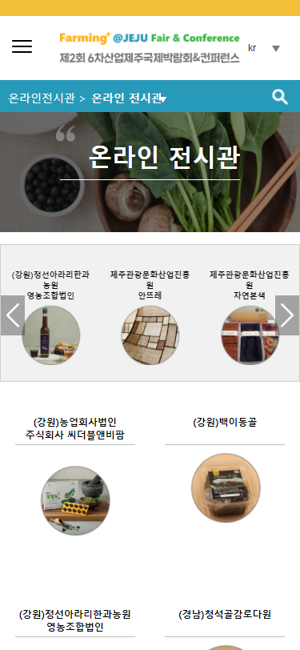

# 제 2회 6차산업 제주 국제 박람회 & 컨퍼런스

## 개요

    퍼블리싱 문서에 리액트 적용 및 기능 구현 작업

-   리덕스 적용
-   반복 컴포넌트 재사용
-   언어 설정 기능(kr, en)
-   자체 api 사용
    -   영상 유형별(id, iframe, embed), 확장자 포맷 처리
    -   리스트 관리(전시관, 공지 및 이벤트)

## 기술 스택

-   ES6
-   React
-   Redux

## 개발 인원 · 역할 · 기간

-   프런트엔드 2명
-   작업 페이지 및 컴포넌트
    -   Header
    -   Language
    -   Home
    -   Welcome
    -   Conference
    -   Notice
    -   SNS
-   2주 작업
-   모바일 버전 동시 작업

## URL

http://6farming-plus-jeju.com/
